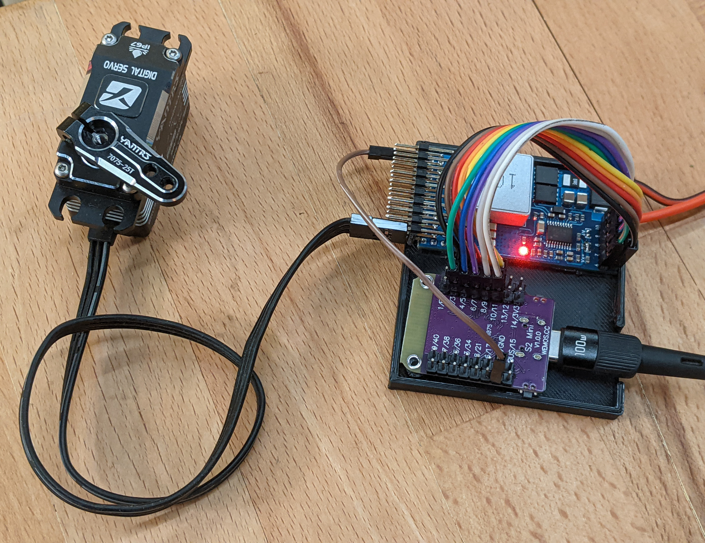

# MIDI Servo Controller Library

The **MIDI Servo Controller** library for Arduino enables seamless integration of MIDI-based control over servos, making it perfect for interactive installations, robotics, animatronics, and other creative applications. Built for the **ESP32-S2/S3** platform, this library allows up to 16 servos to be controlled via standard MIDI Control Change (CC) messages, including 14-bit high-precision CCs. 

---

## Features

- **Multi-Servo Support**: Control up to 16 servos simultaneously.
- **MIDI Integration**: Only supports MIDI CC messages
- **Servo Limits**: Configure servo limits
- **14-bit MIDI CC Support**: For high-resolution servo positioning.
- **Manual Override**: Directly set servo positions or speeds programmatically without MIDI input.
- **ESP32 S2/S3**: Meant for ESP32s with native USB. This could change in the future
---

## Installation

1. Clone or download this repository as a ZIP file.
2. In the Arduino IDE:
   - Go to `Sketch` > `Include Library` > `Add .ZIP Library...`.
   - Select the downloaded ZIP file to add the library.
3. Install the following dependencies:
   - **[ESP32Servo](https://github.com/madhephaestus/ESP32Servo)**
   - **[MIDI Library](https://github.com/FortySevenEffects/arduino_midi_library)**
   - **[Adafruit TinyUSB](https://github.com/adafruit/Adafruit_TinyUSB_Arduino)**

**[NOTE](https://github.com/adafruit/Adafruit_TinyUSB_Arduino#:~:text=Note%3A%20For%20ESP32,version%20from%20v3.0.)** TinyUSB needs at least esp32 v3.0.0 without a workarround.

---

## Getting Started

### Wiring



### Example Usage

Here’s a basic example to get you started:

```cpp
#include <Arduino.h>
#include <MIDI.h>
#include <Adafruit_TinyUSB.h>
#include <ESP32Servo.h>
#include "MIDIServoController.h"

// USB MIDI instance
Adafruit_USBD_MIDI usbMIDI;
MIDI_CREATE_INSTANCE(Adafruit_USBD_MIDI, usbMIDI, MIDI);

MIDIServoController midiServoController;

void setup() {
    // Initialize MIDI and the Servo Controller
    MIDI.begin();
    midiServoController.begin(MIDI);

    // Configure servo on pin 5
    midiServoController.setServoPin(0, 5, 500, 2500, 1500);
    midiServoController.setServoCCs(0, 1, 33, 2); // Set CCs for position and speed
}

void loop() {
    MIDI.read();            // Process incoming MIDI messages
    midiServoController.update(); // Update servo positions
}

```

# API Reference

## Initialization

```cpp
void begin(MIDI_NAMESPACE::MidiInterface<MIDI_NAMESPACE::SerialMIDI<Adafruit_USBD_MIDI>>& midiInterface);
```

Initializes the library and attaches it to a MIDI interface.

## Servo Configuration

### setServoPin

```cpp
void setServoPin(uint8_t servoIndex, uint8_t pin, int minUs = 500, int maxUs = 2500, int centerUs = 1500);
```

Configures a servo with its pin and movement range.
* `servoIndex`: Index of the servo (0–15)
* `pin`: GPIO pin where the servo is connected
* `minUs`, `maxUs`, `centerUs`: Servo timing in microseconds for minimum, maximum, and neutral positions

### setServoCCs

```cpp
void setServoCCs(uint8_t servoIndex, uint8_t coarseCCPosition, uint8_t fineCCPosition, uint8_t CCSpeed = 0xFF);
```

Assigns MIDI CC messages to a servo for position and speed control.
* `servoIndex`: Index of the servo (0–15)
* `coarseCCPosition`, `fineCCPosition`: CC numbers for position (high precision with fine CC)
* `CCSpeed`: Optional CC number for speed control


## Hardware and Library Requirements

* **Microcontroller**: ESP32 with USB support
* **Dependencies**:
   * **ESP32Servo**: Servo control for ESP32
   * **MIDI Library**: MIDI message handling
   * **Adafruit TinyUSB**: USB MIDI support

## Contributing

Contributions are welcome! If you encounter any issues, please open an issue or submit a pull request.

## License

This library is licensed under the MIT License. See the LICENSE file for details.
